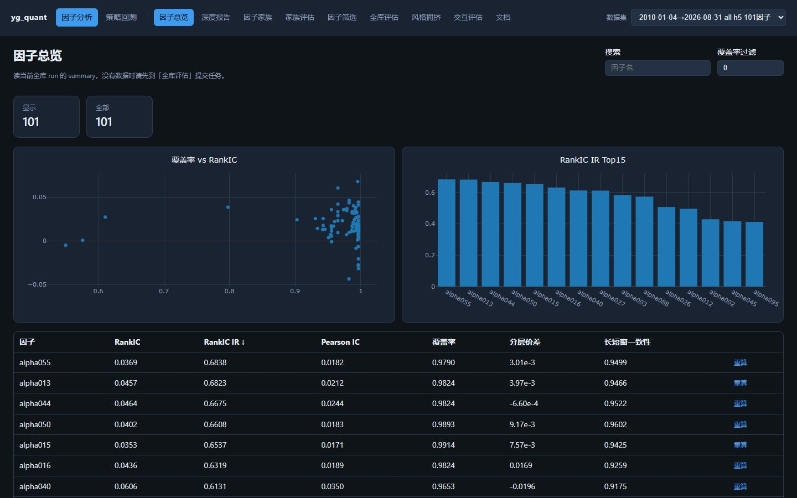
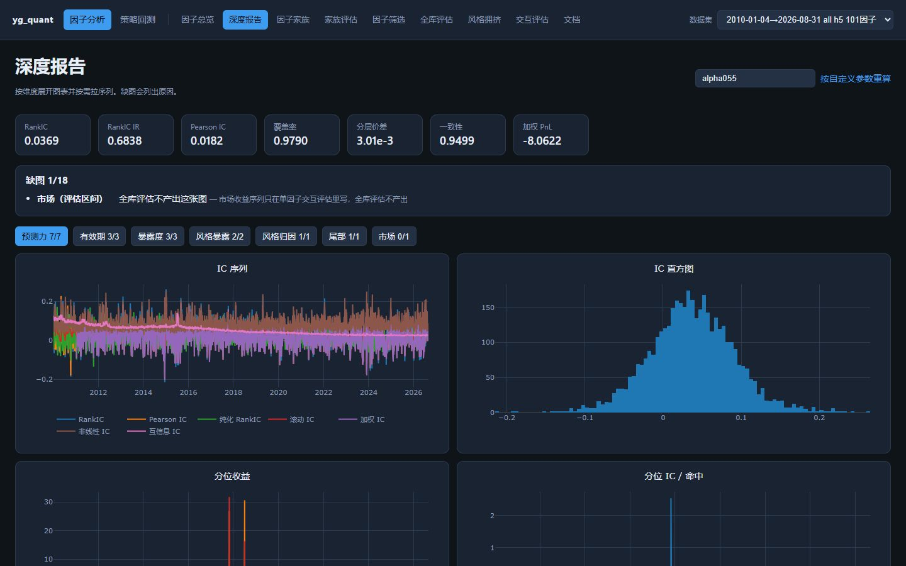
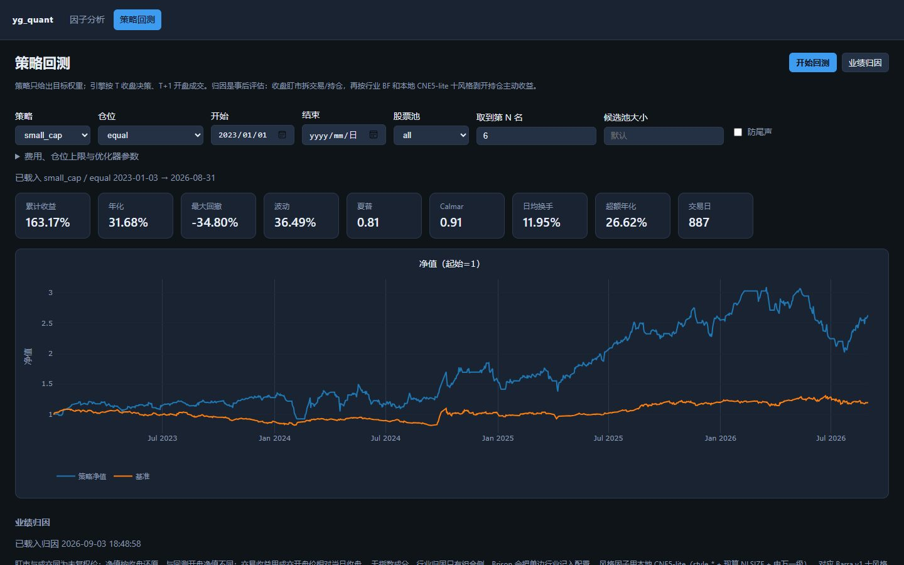
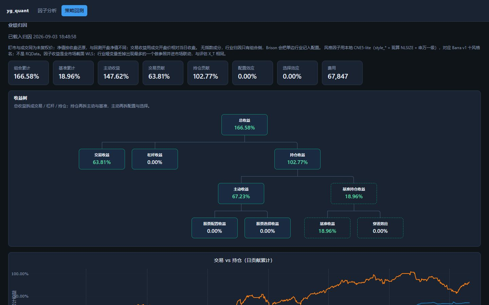

# yg_quant

A 股日频多因子研究平台：因子评估、回测与归因，并可对接迅投 QMT 实盘。

仅供研究使用，不构成投资建议。

从行情入库、算因子、网页评估，到回测和归因。实盘把同一套 `score` 写成 QMT 可读的 JSON。内置小市值策略作参考：周五收盘给名单，下个交易日开盘成交；因子 TopK策略仅作为策略实现的演示。

Python 3.10–3.12。MIT，见 [LICENSE](LICENSE)。

## 效果展示

**因子总览**



**深度报告**



**策略回测**



**业绩归因**



## 目录

| 包 | 做什么 |
|----|--------|
| `DailyUpdates` | 行情入库、因子增量 |
| `FactorEvaluates` | 因子评估 |
| `StyleCrowding` | 风格拥挤 |
| `frontend` / `App` | 网页与后端 |
| `StrategyEngine` | 回测、仓位、实盘桥、归因 |
| `Strategies` | 策略 |
| `Universes` | 股票池 |
| `qmt_scripts` | 拷进迅投 QMT 的脚本 |

入口用 `python -m`。各命令加 `--help` 可看当前参数。

## 安装

```powershell
python -m pip install -r requirements.txt
Copy-Item .env.example .env
```

拉行情需要 `TUSHARE_TOKEN`，写进 `.env` 即可。前端：`cd frontend && npm install`。

数据默认在仓库根 `data/`，已 gitignore。环境变量一览见文末。

## 更新行情

```powershell
python -m DailyUpdates.data_fetcher.main_scheduler
```

空库从 `20050101` 重建，之后按最后交易日增量。增删数据集改 [`main_scheduler.py`](DailyUpdates/data_fetcher/main_scheduler.py) 里的 `dataset_config`。默认 Tushare；也可把 `data_source` 改成 `Akshare`。

| 参数 | 含义 |
|------|------|
| `--start YYYYMMDD` | 可选起点。空库仍从 `20050101` 起；有库时与最后交易日取较晚者。也可用 `YG_QUANT_START_DATE`。 |

截止日用环境变量 `YG_QUANT_END_DATE`，默认当天。

库里是未复权价加一列 `adj_factor`。读的时候默认后复权：`原始价 × adj_factor`。对照原始价设 `YG_QUANT_PRICE_ADJUST=none`。

## 更新因子

```powershell
python -m DailyUpdates.factor_updates.factor_updater
python -m DailyUpdates.factor_updates.factor_updater --only "style_*"
python -m DailyUpdates.factor_updates.factor_updater --rebuild
```

改过实现或复权口径后必须 `--rebuild`，再重跑全库评估。因子放在 `DailyUpdates/factor_updates/factors/`，继承 `BaseFactor`。

| 参数 | 含义 |
|------|------|
| `--rebuild` | 全量重算并覆盖已有序列。等价 `YG_QUANT_FACTOR_REBUILD=1`。 |
| `--only` | 只更新这些因子，逗号分隔，支持 `style_*` 这种前缀。也可用 `YG_QUANT_FACTOR_ONLY`。 |
| `--workers` | 计算线程数，默认 `8`。写入线程另由 `YG_QUANT_FACTOR_WRITE_WORKERS` 控制。 |

## 网页

```powershell
python -m App
```

```powershell
cd frontend
npm run dev
```

打开 `http://127.0.0.1:5173`。评估和回测的日志看跑 `python -m App` 的终端。

## 因子评估

远期收益：`fwd_ret_Nd[T] = open[T+1+N] / open[T+1] - 1`。

```powershell
python -m FactorEvaluates.run_batch --start 2010-01-01
```

| 参数 | 默认 | 含义 |
|------|------|------|
| `--start` | `2010-01-01` | 评估起点 |
| `--end` | 日历末日 | 评估终点 |
| `--universe` | `all` | 股票池，与回测相同 |
| `--horizon` | `5` | 远期收益天数 N |
| `--batch-size` | `32` | 一次装入内存的因子个数 |
| `--n-workers` | `0` | 日度进程数；`0` 为 CPU 核数减 1 |
| `--run-id` | 自动 | 这次全库评估的目录名 |

新指标放进 `FactorEvaluates/metrics/`。

## 股票池

评估、回测、实盘、风格拥挤共用 `--universe`，不改底层数据。规则按当时信息：ST 用历史简称，指数用最近成分快照。

内置：`all`，指数 `hs300` / `zz500` / `zz1000` / `sz50` / `cyb` / `zzhz` / `sme` / `kcb50`，板块 `main` / `gem` / `star` / `bse`。新池在 `Universes/` 加一个 `Universe` 子类。

## 策略回测

信号在收盘 T 可得，目标仓位 T+1 开盘成交。策略只实现 `score(ctx) -> TargetHoldings`。

```powershell
python -m StrategyEngine --mode backtest --start 2010-01-01 --factor alpha001 --n 50
python -m StrategyEngine --mode backtest --strategy small_cap --start 2023-01-01
python -m StrategyEngine --mode backtest --strategy small_cap --allocator min_vol
python -m StrategyEngine --mode live --strategy small_cap --cash 500000 --account 资金账号
python -m StrategyEngine --mode attribute --run small_cap_20260902_120000
```

`--mode` 必填。实盘写出 `data/strategy_runs/qmt_orders.json`，客户端脚本见 [`qmt_scripts/`](qmt_scripts/README.md)。归因读已有回测快照，不重跑策略。也可 `python -m StrategyEngine.attribution --run <快照id>`。

**通用**

| 参数 | 默认 | 含义 |
|------|------|------|
| `--mode` | 必填 | `backtest` 开盘撮合；`live` 写 QMT JSON；`attribute` 读某次回测做归因 |
| `--strategy` | `topk`（若存在） | `Strategies/` 里已发现的策略 |
| `--start` / `--end` | `2010-01-01` / 日历末日 | 回测区间 |
| `--universe` | `all` | 股票池 |
| `--allocator` | `equal` | 候选选出后的权重。可选 `min_vol`、`max_sharpe`、`max_quadratic_utility`、`efficient_return`、`efficient_risk`、`multiobjective`、`min_l2`、`min_semivariance`、`min_cvar`、`min_cdar`、`hrp` |
| `--cash` | `1000000` | 回测初始资金；实盘是分配给该策略的资金 |
| `--commission` / `--stamp` | `0.0003` / `0.0005` | 佣金；印花税仅卖出 |
| `--benchmark` | 沪深300 | 基准指数代码；空字符串或 `--no-benchmark` 关闭 |
| `--out` | 自动 | 回测净值 CSV / 归因 JSON 路径 |

**策略相关**

| 参数 | 含义 |
|------|------|
| `--factor` | topk 用的因子名 |
| `--n` | topk 持仓数，或小市值候选数 |
| `--rebalance` | topk：`daily` 或 `weekly`（周五收盘，T+1 成交） |
| `--hold` | 小市值：剔除最小后取到第 N 名，默认 `6` |
| `--anti-tail` | 小市值防尾声 |

**仓位优化**（`--allocator` 不是 `equal` 时）

| 参数 | 默认 | 含义 |
|------|------|------|
| `--allocator-lookback` | `252` | 收益回看交易日 |
| `--max-weight` | `1` | 单票上限，`1` 表示不限制 |
| `--mu-model` | `geometric` | 需要 μ 时：`geometric` / `arithmetic` / `ema` |
| `--risk-free-rate` | `0.02` | `max_sharpe` 年化无风险利率 |
| `--risk-aversion` | `1` | `max_quadratic_utility` 的风险厌恶 |
| `--target-return` | μ 的 60% 分位 | `efficient_return` 目标年化收益 |
| `--target-volatility` | 等权波动 × 1.15 | `efficient_risk` 目标年化波动 |
| `--l2-gamma` | `0.1` | `multiobjective` / `min_l2` 的 L2 系数 |
| `--tc-rate` | `0.001` | `multiobjective` 换手惩罚 |
| `--tail-confidence` | `0.95` | `min_cvar` / `min_cdar` 的 β |

**实盘 / 归因**

| 参数 | 含义 |
|------|------|
| `--account` | 写入 JSON 的 QMT 资金账号 |
| `--qmt-json` | 对接 JSON 路径，默认 `data/strategy_runs/qmt_orders.json` |
| `--run` | `attribute`：快照 id 或 JSON 路径 |

`python -m StrategyEngine.attribution` 只有 `--run`（必填）和 `--out`。

新策略、新分配器怎么加，见 [CONTRIBUTING.md](CONTRIBUTING.md)。

## 可拓展

数据源、因子、指标、股票池、策略都是放对目录、继承基类就会被扫到。仓位分配器还要在 `REGISTRY` 登记一行。

| 要加 | 放哪里 |
|------|--------|
| 数据源 | `DailyUpdates/data_fetcher/data_sources/` |
| 数据集 | `main_scheduler.py` 的 `dataset_config` |
| 因子 | `DailyUpdates/factor_updates/factors/` |
| 评估指标 | `FactorEvaluates/metrics/` |
| 股票池 | `Universes/` |
| 策略 | `Strategies/` |
| 仓位分配 | `StrategyEngine/allocators/` |

## StyleCrowding

```powershell
python -m StyleCrowding run --start 2018-01-01
python -m StyleCrowding incremental
```

| 子命令 | 参数 | 含义 |
|--------|------|------|
| `run` | `--start` / `--end` | 全量或指定区间，默认从 `2018-01-01` 到日历末日 |
| `run` | `--universe` | 股票池，默认 `all` |
| `run` | `--skip` | 跳过指标，如 `pairwise` |
| `run` | `--group` | 只跑这些分组，如 `10 5` |
| `run` | `--orientation` | `positive` / `reverse` |
| `incremental` | `--end` / `--skip` | 从上次发布的最后一天接着算 |

网页：**因子分析 → 风格拥挤**。详见 [`StyleCrowding/README.md`](StyleCrowding/README.md)。

## 测试

```powershell
python -m pytest tests
```

Akshare 真实接口默认跳过，设 `AKSHARE_LIVE=1` 才跑。

## 第三方

- Alpha101 按 Kakushadze, *101 Formulaic Alphas*, 2016（[arXiv:1601.00991](https://arxiv.org/abs/1601.00991)）。
- 风格轴是研究用实现，不是 MSCI 官方因子。

---

## 附录

### 数据目录

```text
data/
  yg_quant.db
  factors/
  factor_eval/
  style_crowding/
  strategy_runs/
```

覆盖顺序：构造参数 > 环境变量 > `data/`。

| 变量 | 默认 |
|------|------|
| `YG_QUANT_DATA_DIR` | `<仓库根>/data` |
| `YG_QUANT_DB_PATH` | `<数据根>/yg_quant.db` |
| `YG_QUANT_FACTOR_DIR` | 库同级 `factors/` |
| `YG_QUANT_EVAL_DIR` | 库同级 `factor_eval/` |
| `YG_QUANT_STYLE_CROWDING_DIR` | `<数据根>/style_crowding/` |
| `YG_QUANT_START_DATE` / `YG_QUANT_END_DATE` | 空库从 `20050101` 到当天 |
| `YG_QUANT_FACTOR_ONLY` | 全部因子 |
| `YG_QUANT_FACTOR_REBUILD` | 增量 |
| `YG_QUANT_FACTOR_WORKERS` | `8` |
| `YG_QUANT_PRICE_ADJUST` | `hfq` |
| `YG_QUANT_BETA_INDEX` | `index_SH000300` |

### 库表

行情在 `market_data`，因子在 `data/factors/` 的 bin，不进 SQLite。其余是行业、股票资料、财务、指数成分等 sidecar。财务截面对齐用 `ann_date`。
